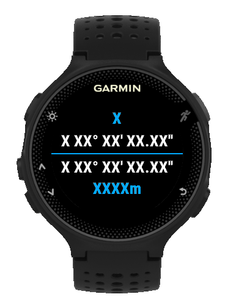
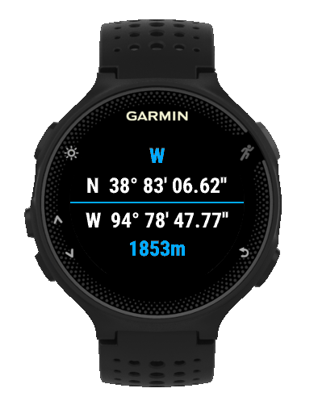

# Point

:watch: A widget for Garmin Connect IQ [Available Here !](https:// "Connect IQ")

This widget show your:

* Orientation [ N, NE, E, SE, S, SW, W, NW ]

* Longitude [ X XX° XX' XX.XX" ]

* Latitude [ X XX° XX' XX.XX" ]

* Altitude [ XXXXm ]

## How it's work ?

When the watch don't get the GPS signal, the widget display XXXX value. And GPS signal is ready, the widget display right values.

 

## Watch support

* Forerunner® 235

I hope you'll enjoy it :v: